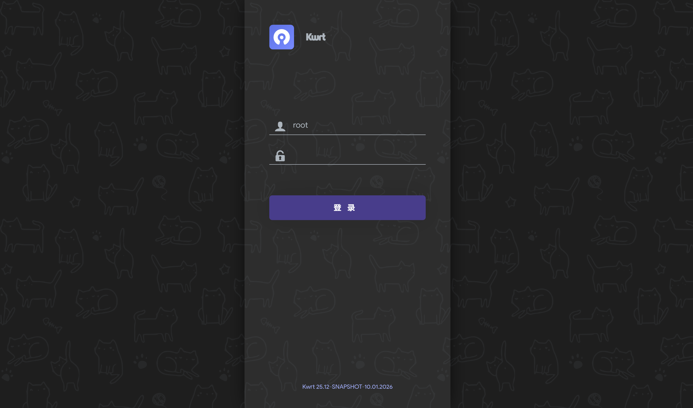
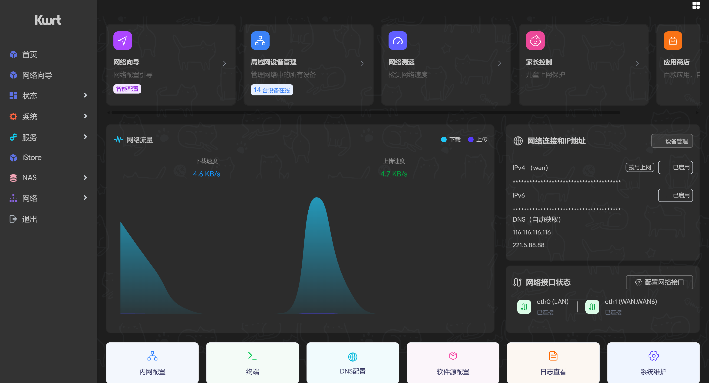
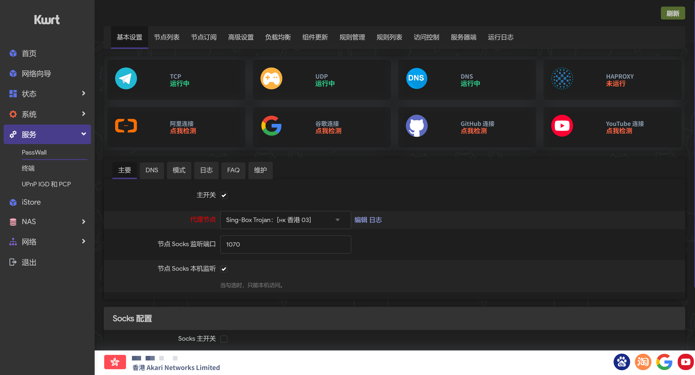
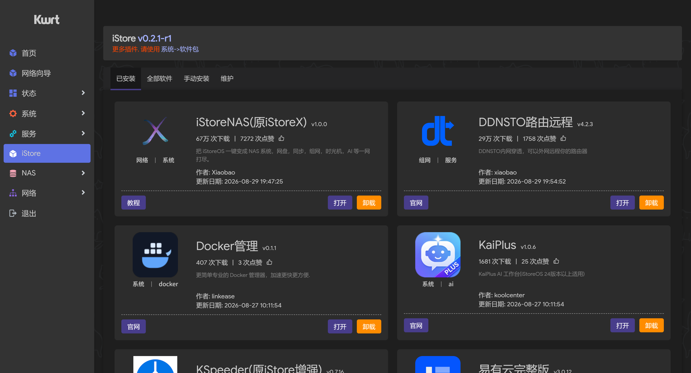
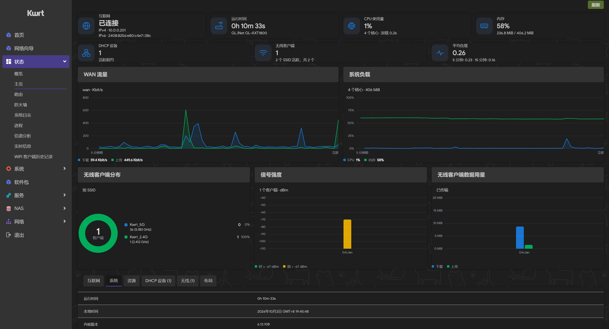
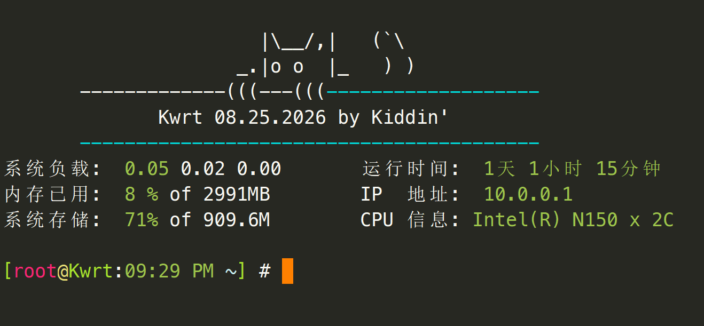

## 本 fork 的自用固件

在 **Actions → Build OpenWrt → Run workflow** 选择 `device`：

| device | 设备与上网方式 | 后台地址 |
| --- | --- | --- |
| `ax6000`（默认） | Redmi AX6000，现有 PPPoE 配置 | `192.168.10.1` |
| `cudy_tr3000` | Cudy TR3000 v1 112M，F50 USB 共享网络 | `192.168.20.1` |

首次编译新机型或需要刷新 feeds 时勾选 `nocache`。两个机型分别使用缓存和 Artifacts，下载名称包含所选机型。
Repo Dispatcher 也支持同样的机型选择，可通过 `param` 传入 `ssh`、`nocache` 等参数，每次只触发所选设备。

Cudy 复用本仓库的 `cudy_tr3000-mod` 112M 分区布局，不适用于原厂 64M 可用布局或 OpenWrt 官方 U-Boot layout。
设备配置在 `devices/cudy_tr3000/`，共享 mediatek/filogic 补丁与插件源。

- F50 接 USB 数据线后，`wan_f50` 接口自动绑定 RNDIS/CDC Ethernet/NCM 网卡，通过 DHCP 上网；原有线 WAN 保留，USB 路由优先。
- 内置 USB 网络驱动、USB Storage、FAT/exFAT 支持和 `usbutils`。USB Storage 只在 F50 将存储暴露为 USB 磁盘时可用，不会自动格式化或挂载存储卡。
- Cudy 沿用 Argon、PassWall2、Tailscale、Turbo ACC、双频 `Home 2.4G` / `Home 5G` Wi-Fi、HTTPS 后台和 SSH 端口 `30001`，不写入 AX6000 的 PPPoE、光猫访问或 LAN 端口设置。
- Cudy 使用仓库的 `ROOT_PASSWD`、`WIFI_PASSWD` Actions Secrets；AX6000 继续使用现有 Secrets。Cudy 密码以 shell 引号转义，支持特殊字符。
- 编译后检查所选机型、插件与 USB 驱动清单以及固件 SHA256，再上传 Artifacts。实机 USB 供电、启动和网络稳定性仍需接机验证。

Cudy 的 LAN 为 `192.168.20.0/24`，AX6000 的 LAN 为 `192.168.10.0/24`；两台在各自家中都可通过 `https://router.lan` 访问后台（客户端需使用对应路由器的 DNS）。Cudy 登录 Tailscale 后按需发布 `192.168.20.0/24`，AX6000 的子网发布仍按原来的配置恢复。F50 USB 侧通过 DHCP 获取地址，接机后核对其网段与 Cudy LAN 不重叠。

### Tailscale 基础配置

两台预设 `tailscale` 接口（`tailscale0`、协议 `none`）与 Tailscale 防火墙区域，允许 LAN 与 Tailscale 双向转发、Tailscale 到有线 WAN 转发；Cudy 额外允许到 F50 USB 上网区域转发。保留现有 UDP 41641 入站规则与 HTTPS 后台访问设置。

**默认关闭 Tailscale 服务。** 设置辅助脚本仅登记配置变化，已修正为先检查启用开关：未启用时不启动 tailscaled，也不应用 DNS 或路由设置。 首次启动脚本只运行一次，手动开启后不会在每次重启时关闭。升级后即使保留了旧配置，也需要重新开启服务；登录状态文件不会由这个脚本读取、复制或删除。

需要时在 LuCI 的 Tailscale 页面启用服务并自行登录、配置子网或出口节点、在 Tailscale 管理后台授权。使用 CLI 时先执行：

```sh
# CLI 管理时关闭辅助脚本，避免它覆盖 CLI 参数。
[ ! -x /etc/init.d/tailscale-settings ] || { /etc/init.d/tailscale-settings disable; /etc/init.d/tailscale-settings stop; }
uci set tailscale.settings.service_enabled='1'
uci commit tailscale
/etc/init.d/tailscale enable
/etc/init.d/tailscale start
```

然后按自己的用途运行 `tailscale up`；预设防火墙可配合 `--netfilter-mode=off` 使用。默认脚本不登录、不发布子网或出口、不设置 DNS 或默认路由，也不包含认证密钥或设备状态。同一家庭的旧配置只能恢复到原设备，两台不能共用登录状态。

### 上游同步与兼容修复

本 fork 保留原有提交历史，通过正常合并同步 `kiddin9/Kwrt` 的 `25.12` 分支。2026-10-03 已核对并同步上游 `3bf5f803`，包括安装 LuCI ACL 后刷新 rpcd 的处理。

当前保留三项已由实际失败日志确认的构建修复：完整同步 Go 编译器及辅助文件、为 Tailscale 单独设置 `GOEXPERIMENT=nojsonv2`、恢复 dnsmasq 的官方运行依赖并去掉重复共享库打包。更新上游时需要复核对应问题是否已解决，再移除修复；不能直接用上游文件覆盖这些差异。

最新插件源已修正 PassWall2 资源路径，Xray 旧 `AllowInsecure.patch` 已不存在，因此移除了两处过时处理。完整文件差异、历史提交及验证范围见 [上游对比与清理审查](docs/upstream-review-20261003.md)。编译成功后仍需要核验实际固件产物和实机运行。

---

## 上游项目说明

以下保留上游项目的介绍；本 fork 的预装插件和设备默认值以上面的自用固件说明为准。

#### 固件下载与在线定制: [openwrt.ai](https://openwrt.ai)

### openwrt 软路由固件

#### 基于官方openwrt-25.12最新稳定分支, 并基于国内使用喜欢做大量优化

#### 原生极致纯净, 固件默认只包含基础上网功能, 后台在线选装插件, 或在线定制包含指定插件的固件

#### 自建在线插件仓库 [dl.openwrt.ai](https://dl.openwrt.ai), 额外收录三方插件1000+, 插件库日更

##### TG群: [Kwrt交流群](https://t.me/opkwrt)













## Acknowledgments

- [OpenWrt](https://github.com/openwrt/openwrt)
- [Lean's OpenWrt](https://github.com/coolsnowwolf/lede)
- [ImmortalWrt](https://github.com/immortalwrt/immortalwrt)
- [iStoreOS](https://github.com/istoreos)
- [unifreq](https://github.com/unifreq/openwrt_packit)
- [ophub](https://github.com/ophub/amlogic-s9xxx-openwrt)
- [hanwckf](https://github.com/hanwckf/immortalwrt-mt798x)
- [aparcar](https://github.com/openwrt/asu)
- [GitHub](https://github.com)
- [GitHub Actions](https://github.com/features/actions)
